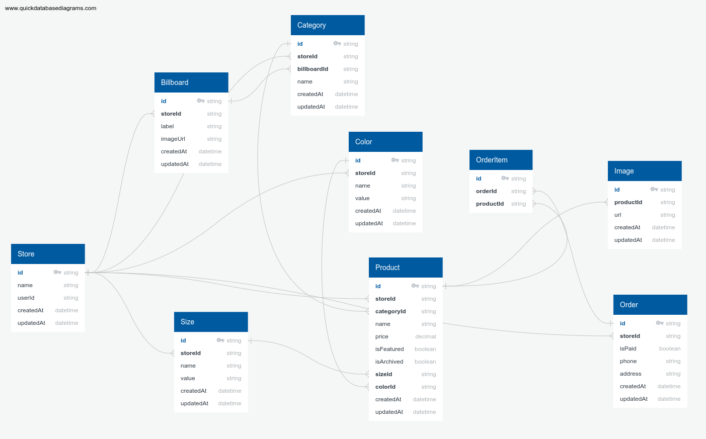

# Fashion Fusion E-Commerce Platform (Next.js 13, Tailwind, Prisma, MySQL, Clerk, Stripe)

## Admin Dashboard and Storefront

### Deployed URLs

Admin Dashboard: [https://fashion-fusion-khantseithu.vercel.app/](https://fashion-fusion-khantseithu.vercel.app/)

Storefront: [https://fashion-fusion-storefront.vercel.app/](https://fashion-fusion-storefront.vercel.app/)

For DEMO, use [Stripe Testing Cards](https://stripe.com/docs/testing)

This is a repository for a Full Stack E-Commerce + Dashboard & CMS: Next.js 13 App Router, React, Tailwind, Prisma, MySQL.

## Key Features:

### Common Features for Admin Dashboard and Storefront:

- We will be using Shadcn UI for the Admin!
- Our admin dashboard serves as both CMS, Admin, and API!
- You can control multiple vendors/stores through this single CMS! For example, you can have a "Shoe store," a "Laptop store," and a "Suit store," and our CMS will generate API routes for all of them individually!
- Create, update, and delete categories.
- Create, update, and delete products.
- Upload multiple images for products and change them whenever you want.
- Create, update, and delete filters such as "Color" and "Size," and then match them in the "Product" creation form.
- Create, update, and delete "Billboards," which are these big texts on top of the page. You can attach them to a single category or use them standalone (Our Admin generates API for all of those cases!).
- Search through all categories, products, sizes, colors, billboards with included pagination.
- Control which products are "featured" so they show on the homepage.
- View orders, sales, and more.
- See graphs of your revenue, etc.
- Learn Clerk Authentication.
- Order creation.
- Stripe checkout.
- Stripe webhooks.
- MySQL + Prisma + PlanetScale.

### Additional Features for Admin Dashboard:

- We will be using Shadcn UI for the Admin!
- Our admin dashboard is going to serve as both CMS, Admin, and API!
- You will be able to see your orders, sales, etc.
- You will be able to see graphs of your revenue etc.
- You will learn Clerk Authentication.

### Additional Features for Storefront:

- The storefront allows customers to browse and shop for products.
- Customers can add items to their shopping cart.
- Checkout process for customers to complete their purchase.
- Integration with Stripe for secure payment processing.

## Database schema

