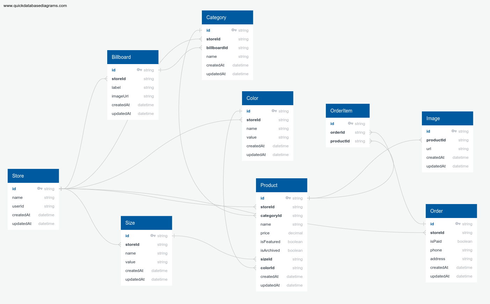

# Fashion Fusion Admin Dashboard (Next.js 13, Tailwind, Prisma, MySQL, Clerk, Stripe)

Deployed on Vercel: [https://fashion-fusion-khantseithu.vercel.app/](https://fashion-fusion-khantseithu.vercel.app/)
For DEMO, use [Stripe Testing Cards](https://stripe.com/docs/testing)

This is a repository for a Full Stack E-Commerce + Dashboard & CMS: Next.js 13 App Router, React, Tailwind, Prisma, MySQL

Key Features:

- We will be using Shadcn UI for the Admin!
- Our admin dashboard is going to serve as both CMS, Admin and API!
- You will be able to control mulitple vendors / stores through this single CMS! (For example you can have a "Shoe store" and a "Laptop store" and a "Suit store", and our CMS will generate API routes for all of those individually!)
- You will be able to create, update and delete categories!
- You will be able to create, update and delete products!
- You will be able to upload multiple images for products, and change them whenever you want!
- You will be able to create, update and delete filters such as "Color" and "Size", and then match them in the "Product" creation form.
- You will be able to create, update and delete "Billboards" which are these big texts on top of the page. You will be able to attach them to a single category, or use them standalone (Our Admin generates API for all of those cases!)
- You will be able to Search through all categories, products, sizes, colors, billboards with included pagination!
- You will be able to control which products are "featured" so they show on the homepage!
- You will be able to see your orders, sales, etc.
- You will be able to see graphs of your revenue etc.
- You will learn Clerk Authentication!
- Order creation
- Stripe checkout
- Stripe webhooks
- MySQL + Prisma + PlanetScale

## Database schema



## Folder Structure

```bash
.
├── LICENSE
├── README.md
├── actions
│   ├── get-graph-revenue.ts
│   ├── get-sales-count.ts
│   ├── get-stock-count.ts
│   └── get-total-revenue.ts
├── app
│   ├── (auth)
│   │   ├── (routes)
│   │   │   ├── sign-in
│   │   │   │   └── [[...sign-in]]
│   │   │   │       └── page.tsx
│   │   │   └── sign-up
│   │   │       └── [[...sign-up]]
│   │   │           └── page.tsx
│   │   └── layout.tsx
│   ├── (dashboard)
│   │   └── [storeId]
│   │       ├── (routes)
│   │       │   ├── billboards
│   │       │   │   ├── [billboardId]
│   │       │   │   │   ├── components
│   │       │   │   │   │   └── billboard-form.tsx
│   │       │   │   │   └── page.tsx
│   │       │   │   ├── components
│   │       │   │   │   ├── cell-action.tsx
│   │       │   │   │   ├── client.tsx
│   │       │   │   │   └── columns.tsx
│   │       │   │   ├── loading.tsx
│   │       │   │   └── page.tsx
│   │       │   ├── categories
│   │       │   │   ├── [categoryId]
│   │       │   │   │   ├── components
│   │       │   │   │   │   └── category-form.tsx
│   │       │   │   │   └── page.tsx
│   │       │   │   ├── components
│   │       │   │   │   ├── cell-action.tsx
│   │       │   │   │   ├── client.tsx
│   │       │   │   │   └── columns.tsx
│   │       │   │   ├── loading.tsx
│   │       │   │   └── page.tsx
│   │       │   ├── colors
│   │       │   │   ├── [colorId]
│   │       │   │   │   ├── components
│   │       │   │   │   │   └── color-form.tsx
│   │       │   │   │   └── page.tsx
│   │       │   │   ├── components
│   │       │   │   │   ├── cell-action.tsx
│   │       │   │   │   ├── client.tsx
│   │       │   │   │   └── columns.tsx
│   │       │   │   ├── loading.tsx
│   │       │   │   └── page.tsx
│   │       │   ├── orders
│   │       │   │   ├── components
│   │       │   │   │   ├── client.tsx
│   │       │   │   │   └── columns.tsx
│   │       │   │   ├── loading.tsx
│   │       │   │   └── page.tsx
│   │       │   ├── page.tsx
│   │       │   ├── products
│   │       │   │   ├── [productId]
│   │       │   │   │   ├── components
│   │       │   │   │   │   └── product-form.tsx
│   │       │   │   │   └── page.tsx
│   │       │   │   ├── components
│   │       │   │   │   ├── cell-action.tsx
│   │       │   │   │   ├── client.tsx
│   │       │   │   │   └── columns.tsx
│   │       │   │   ├── loading.tsx
│   │       │   │   └── page.tsx
│   │       │   ├── settings
│   │       │   │   ├── components
│   │       │   │   │   └── settings-form.tsx
│   │       │   │   ├── loading.tsx
│   │       │   │   └── page.tsx
│   │       │   └── sizes
│   │       │       ├── [sizeId]
│   │       │       │   ├── components
│   │       │       │   │   └── size-form.tsx
│   │       │       │   └── page.tsx
│   │       │       ├── components
│   │       │       │   ├── cell-action.tsx
│   │       │       │   ├── client.tsx
│   │       │       │   └── columns.tsx
│   │       │       ├── loading.tsx
│   │       │       └── page.tsx
│   │       └── layout.tsx
│   ├── (root)
│   │   ├── (routes)
│   │   │   └── page.tsx
│   │   └── layout.tsx
│   ├── api
│   │   ├── [storeId]
│   │   │   ├── billboards
│   │   │   │   ├── [billboardId]
│   │   │   │   │   └── route.ts
│   │   │   │   └── route.ts
│   │   │   ├── categories
│   │   │   │   ├── [categoryId]
│   │   │   │   │   └── route.ts
│   │   │   │   └── route.ts
│   │   │   ├── checkout
│   │   │   │   └── route.ts
│   │   │   ├── colors
│   │   │   │   ├── [colorId]
│   │   │   │   │   └── route.ts
│   │   │   │   └── route.ts
│   │   │   ├── products
│   │   │   │   ├── [productId]
│   │   │   │   │   └── route.ts
│   │   │   │   └── route.ts
│   │   │   └── sizes
│   │   │       ├── [sizeId]
│   │   │       │   └── route.ts
│   │   │       └── route.ts
│   │   ├── stores
│   │   │   ├── [storeId]
│   │   │   │   └── route.ts
│   │   │   └── route.ts
│   │   └── webhook
│   │       └── route.ts
│   ├── favicon.ico
│   ├── globals.css
│   ├── layout.tsx
│   └── loading.tsx
├── components
│   ├── main-nav.tsx
│   ├── modals
│   │   ├── alert-modal.tsx
│   │   └── store-modal.tsx
│   ├── navbar.tsx
│   ├── overview.tsx
│   ├── store-switcher.tsx
│   ├── theme-toggle.tsx
│   ├── ui
│   │   ├── alert.tsx
│   │   ├── api-alert.tsx
│   │   ├── api-list.tsx
│   │   ├── avatar.tsx
│   │   ├── badge.tsx
│   │   ├── button.tsx
│   │   ├── card.tsx
│   │   ├── checkbox.tsx
│   │   ├── command.tsx
│   │   ├── data-table.tsx
│   │   ├── dialog.tsx
│   │   ├── dropdown-menu.tsx
│   │   ├── form.tsx
│   │   ├── heading.tsx
│   │   ├── image-upload.tsx
│   │   ├── input.tsx
│   │   ├── label.tsx
│   │   ├── loader.tsx
│   │   ├── modal.tsx
│   │   ├── popover.tsx
│   │   ├── select.tsx
│   │   ├── separator.tsx
│   │   ├── table.tsx
│   │   └── tabs.tsx
│   └── user-nav.tsx
├── components.json
├── hooks
│   ├── use-active-store.tsx
│   ├── use-category-modal.tsx
│   ├── use-origin.tsx
│   ├── use-product-modal.tsx
│   └── use-store-modal.tsx
├── lib
│   ├── prismadb.ts
│   ├── stripe.ts
│   └── utils.ts
├── middleware.ts
├── next.config.js
├── package-lock.json
├── package.json
├── postcss.config.js
├── prisma
│   └── schema.prisma
├── providers
│   ├── modal-provider.tsx
│   ├── theme-provider.tsx
│   └── toast-provider.tsx
├── public
│   ├── empty.png
│   ├── next.svg
│   └── vercel.svg
├── tailwind.config.js
└── tsconfig.json

61 directories, 128 files
```
